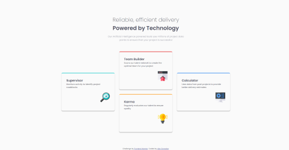
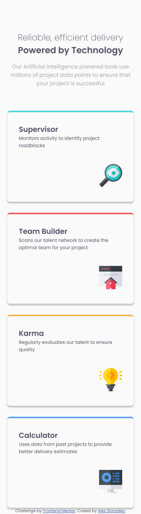
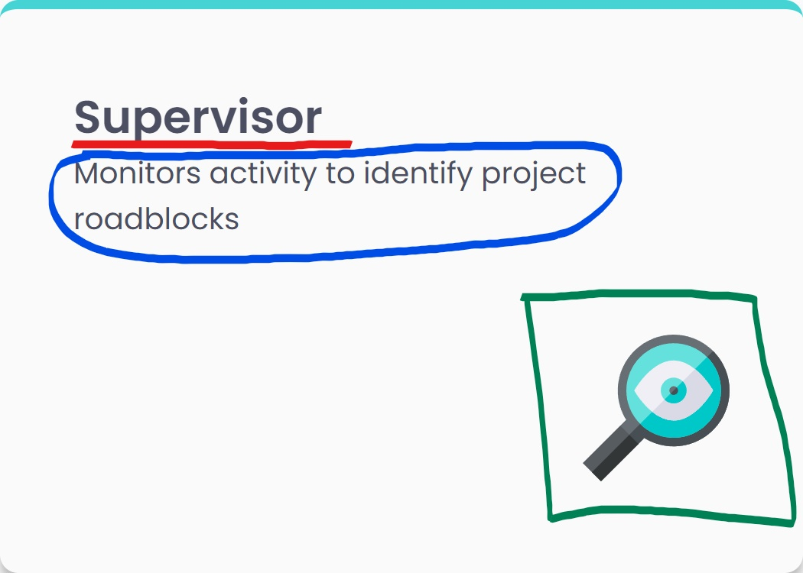

# Frontend Mentor - Four card feature section solution

This is a solution to the [Four card feature section challenge on Frontend Mentor](https://www.frontendmentor.io/challenges/four-card-feature-section-weK1eFYK). Frontend Mentor challenges help you improve your coding skills by building realistic projects.

## Table of contents

- [Frontend Mentor - Four card feature section solution](#frontend-mentor---four-card-feature-section-solution)
  - [Table of contents](#table-of-contents)
  - [Overview](#overview)
    - [The challenge](#the-challenge)
    - [Screenshot](#screenshot)
      - [Desktop](#desktop)
      - [Mobile](#mobile)
    - [Links](#links)
  - [My process](#my-process)
    - [Built with](#built-with)
    - [What I learned](#what-i-learned)
    - [Continued development](#continued-development)
    - [Useful resources](#useful-resources)
  - [Author](#author)

## Overview

### The challenge

Users should be able to:

- View the optimal layout for the site depending on their device's screen size

### Screenshot

#### Desktop



#### Mobile



### Links

- Solution URL: [Github Repo](https://github.com/luinrandir/four-card-feature)
- Live Site URL: [Live Demo](https://luinrandir.github.io/four-card-feature)

## My process

### Built with

- [React](https://reactjs.org/) - JS library
- [TypeScript](https://www.typescriptlang.org/)

### What I learned

For this project I used some of the same tools which includes:

- Semantic HTML5 markup
- CSS custom properties
- Flexbox
- CSS Grid
- Mobile-first workflow

The exception is that I took previous knowledge of these tools and incorporated them with **React** and **TypeScript**. I felt that this would be a great first React project: something simple and with some complexity. However, while working on this project I found myself making it more difficult then it needed to be. At some point I considered using **Sass** but ultimately decided against the choice. I am glad I decided to as it forced me to just use plain CSS while getting my feet wet with React.

The thought behind using React was for the actual card component. The inital code however, was not simple at all. The first thing I had to do was figure out how to take an object I wanted to extract as a component and break it down.



The above card was something that I wanted to create to be a reusable component, with expection to this challenge of course. So I decided to break down into the marks that you see on the image. From those marks we can get the following information:

- A Title
- A Description
- An Icon

From that information I crafted my intial draft of my card component.

```TSX
function card() {
  return (
    <div className="card">
      <h2>Supervisor</h2>
      <p>Monitors activity to identify project roadblocks</p>
      
    </div>
  );
}
```

After crafting an initial draft I started to factor in the props I needed.

```TSX
function card({
  title,
  description,
  iconPath,
  iconDescription,
}: {
  title: string;
  description: string;
  iconPath: string;
  iconDescription: string;
}) {
  return (
    <div className="card">
      <h2>{title}</h2>
      <p>{description}</p>
      
    </div>
  );
}
```

At this point I knew it would be easier if I went ahead and created a `Category` type to make reading the code a bit easier. `borderColor` was also added as a prop to allow an easier way to create the top borders of each card. This was primarily for the challenge. Finally the `h2` and `p` tags were wrapped in a `div` to allow for grid to work more effectively. Below is a snippet of the final code.

```TSX
// Category.ts
export type Category = {
  title: string;
  description: string;
  iconPath: string;
  iconDescription: string;
};

// Card.tsx
function Card({
  category,
  borderColor,
}: {
  category: Category;
  borderColor: "red" | "cyan" | "orange" | "blue";
}) {
  return (
    <div className={`card ${borderColor}`}>
      <div>
        <h2>{category.title}</h2>
        <p>{category.description}</p>
      </div>
      
    </div>
  );
}
```

I am proud of this. I feel that I could clean this up even more, but for a first time really using React for a project/challenge, I believe I did well. The process to get here was rewarding. The React Docs were a fantastic help and because of them I learned how to create my first component with the CSS to go with it.

Once I got the component completed, connecting the component to the main app file felt trivial but also oddly difficult. I felt that I was once again making things more difficult than they needed to be. I was once again reminded about **Keeping it Simple** and decided to do so after a messy attempt to use a Map for each of the cards. Eventually I decided against that and used the following format.

```TSX
<Card
  category={{
    title: "Supervisor",
    description: "Monitors activity to identify project roadblocks",
    iconPath: "icon-supervisor.svg",
    iconDescription: "Magnifying Lense with Eyeball",
  }}
  borderColor="cyan"
/>
```

Overall I felt that I learned a lot with the challenge in regards to React. I am looking foward to the future with this JS Library.

### Continued development

I plan on continuing to use React for small component based challenges to really get use to creating components. I also plan on using TypeScript over JavaScript to simply get use to using Types. Personally I enjoy the type saftey that it proivdes as I am writing code. It pushes me to really consider how I am coding, but can be a bit annoying at times. I do wish to start incorporating Sass alongside React, but only if it does not make things more difficult than it needs to be.

### Useful resources

-[React Docs](https://react.dev/) - Really helped me with getting started with React

## Author

- Frontend Mentor - [@luinrandir](https://www.frontendmentor.io/profile/luinrandir)
- Github - [@luinrandir](https://github.com/luinrandir)
